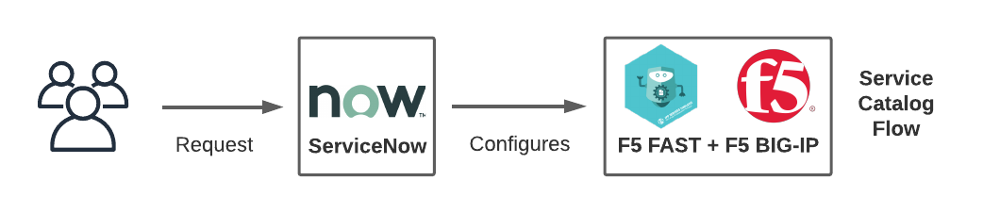

# F5 FAST ServiceNow Demo

This repository is a demonstration of how [ServiceNow Flow Designer](https://www.servicenow.com/products/platform-flow-designer.html) can be used to integrate ServiceNow with [F5 FAST](https://clouddocs.f5.com/products/extensions/f5-appsvcs-templates/latest/). The steps in the instructions below creates a ServiceNow service catalog form capable of sending an API call to F5 FAST when the form is submitted. The value of this solution is it integrates F5 FAST's ability to automate BIG-IP standard changes with the ITSM capabilities of ServiceNow.

## Instructions

Full text instructions for deploying this demonstration lab can be found [here.](docs/instructions.md)

A video demonstrating these instructions can be found [here.](https://www.youtube.com/watch?v=xYAOlFrnqCE)

