# Instructions

This guide will walk you through setting up a ServiceNow Service Catalog and F5 BIG-IP to automate F5 VIP configurations through a service catalog form and [F5 FAST](https://clouddocs.f5.com/products/extensions/f5-appsvcs-templates/latest/).

A video demonstrating these instructions can be found [here](https://www.youtube.com/watch?v=xYAOlFrnqCE)

## Prerequisites

In order to get started, the following prerequisites are required:

* [Terraform](https://learn.hashicorp.com/collections/terraform/aws-get-started)
* [A ServiceNow Developer Account](https://developer.servicenow.com/dev.do)
* [AWS CLI configured with a working AWS Account](https://docs.aws.amazon.com/cli/latest/userguide/cli-configure-quickstart.html)

## Steps

#### Table of Contents

1. [Spinning up your ServiceNow Developer Tenant](#spinning-up-your-servicenow-developer-tenant)
2. [Building the ServiceNow Configuration and F5 BIG-IP with Terraform](#building-the-servicenow-configuration-and-f5-big-ip-with-terraform)
3. [Building the ServiceNow Flow](#building-the-servicenow-flow)
4. [Modifying Required System Properties](#modifying-required-system-properties)
5. [Testing the Service Catalog](#testing-the-service-catalog)
6. [Verifying the F5 BIG-IP Configuration](#verifying-the-f5-big-ip-configuration)
7. [Cleanup](#cleanup)

#### Spinning up your ServiceNow Developer Tenant

1. Log into developer.servicenow.com

2. Once logged in, click the `Start Building` button on developer.servicenow.com

   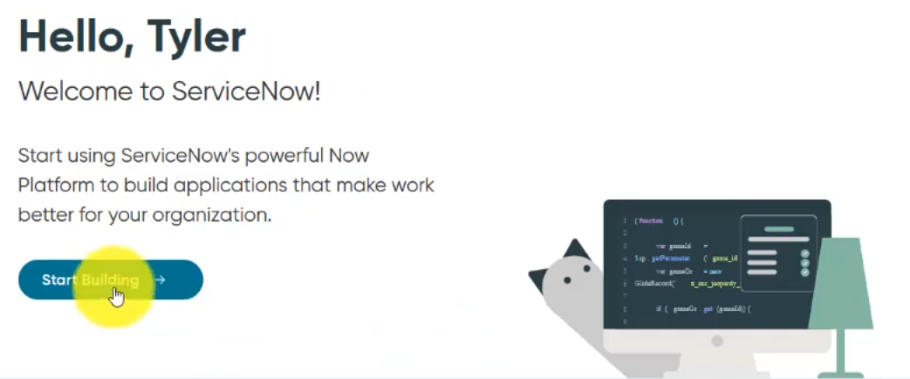

3. Select the latest release available to you and click ``Request``

   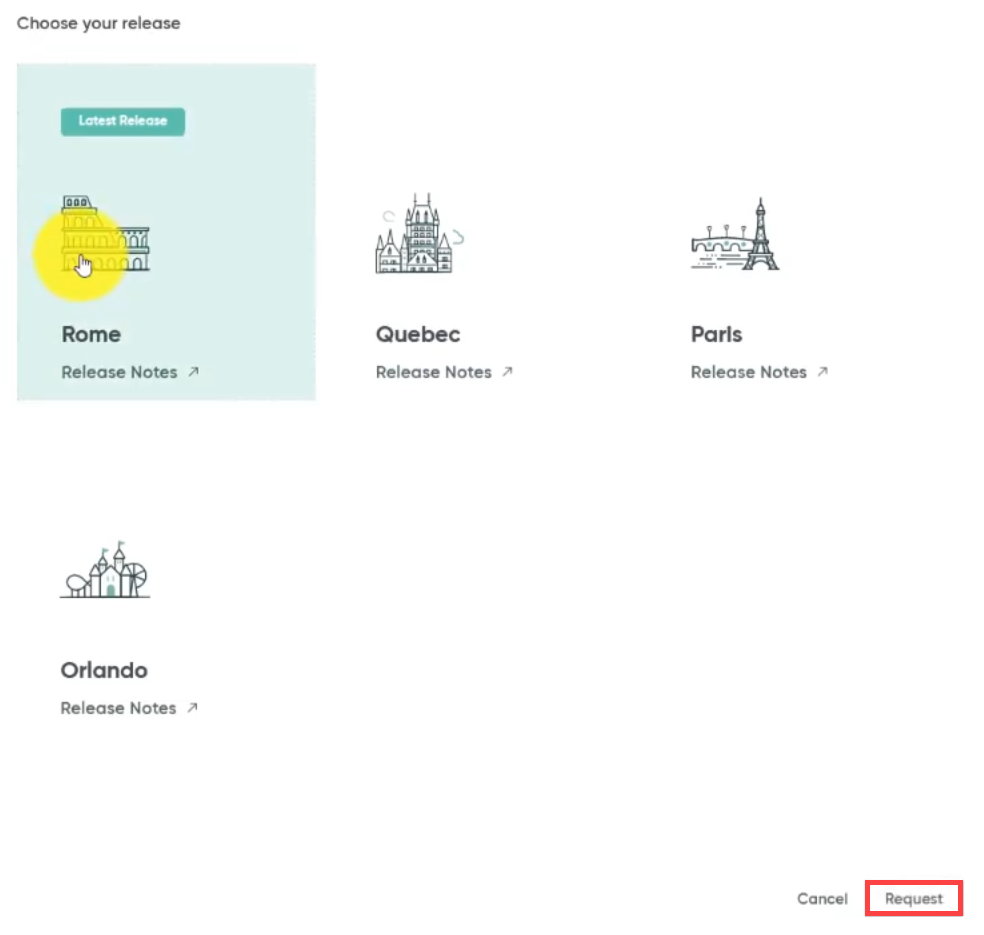

4. Once the developer tenant has successfully started, a prompt will appear containing the developer tenant URL, admin username, and admin password. **Please record the URL, username, and password for later steps**

   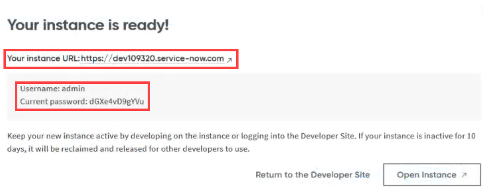

5. Close the 'Instance is Ready!' prompt, click the user icon in the top right, and click the ``Activate Plugin`` link.

   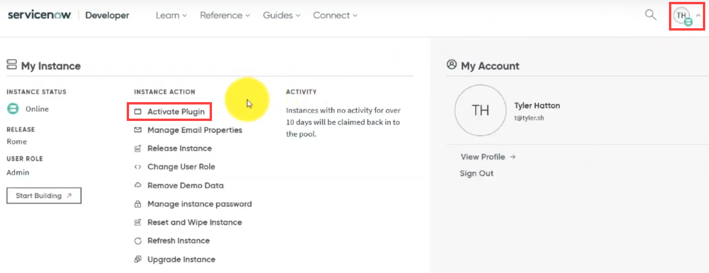

6. In the 'Activate Plugin' window filter for IntegrationHub, click the ``Activate`` button next to ServiceNow IntegrationHub Installer.

   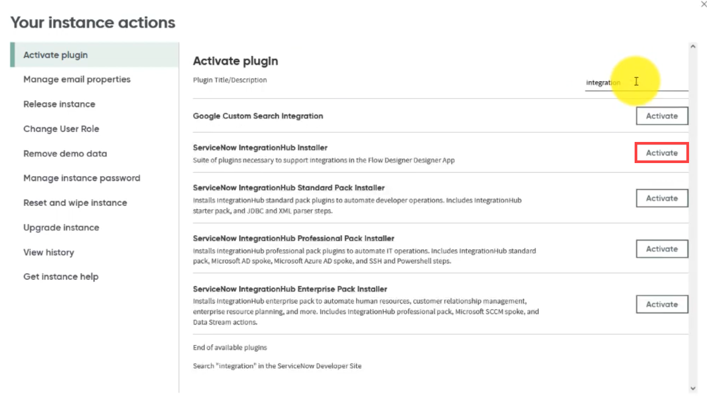

#### Building the ServiceNow Configuration and F5 BIG-IP with Terraform

1. Open up a terminal window and clone down the project repository by running the following command:

    ```bash
    git clone git@github.com:tylerhatton/f5-fast-servicenow-demo.git
    cd f5-fast-servicenow-demo
    ```

2. Create a copy of the templated Terraform variables file using the following command:

    ```bash
    cp terraform.tfvars.example terraform.tfvars
    ```

3. Using your text editor of choice, modify the new terraform.tfvars file to include the ServiceNow URL, username, password that was provided when you created your developer tenant.

   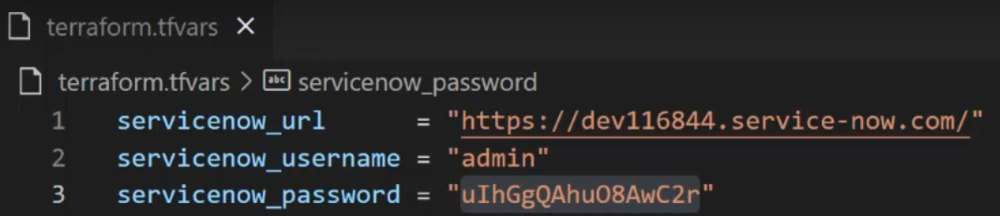

4. Run the following Terraform command to apply the Terraform template that create the base ServiceNow configurations and F5 BIG-IP running inside AWS.

    ```bash
    terraform apply -auto-approve
    ```

5. Once the Terraform template has completed running, a list of outputs containing the provisioned BIG-IP's public ip, username, and password will provided. To see the unobfuscated password, run ``terraform output -json``. **Copy the values for bigip_public_ip, bigip_username, and bigip_password for later steps.**

   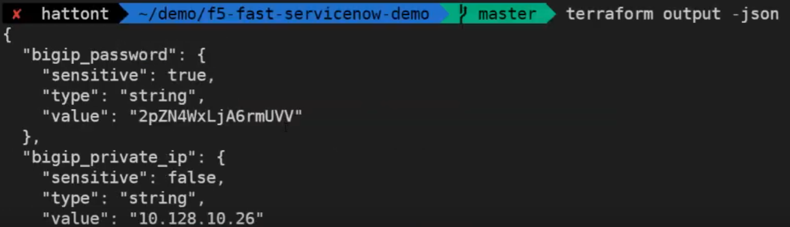

#### Building the ServiceNow Flow

1. Log into your ServiceNow developer environment by going to developer.servicenow.com and clicking ``Start Building``.

   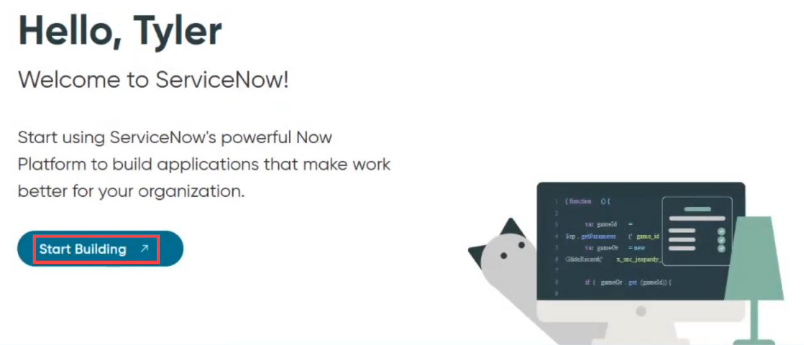

2. In the left navigation pane, filter for flow designer and click the ``flow designer`` link.

   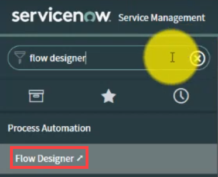

3. Inside the flow designer interface, click the ``New`` button and then the ``Action`` link.

   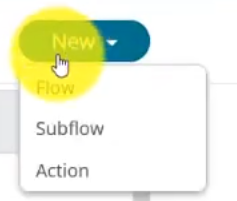

4. Inside the Action properties prompt, fill in the action name ``Send to F5 FAST`` and click ``Submit``.

   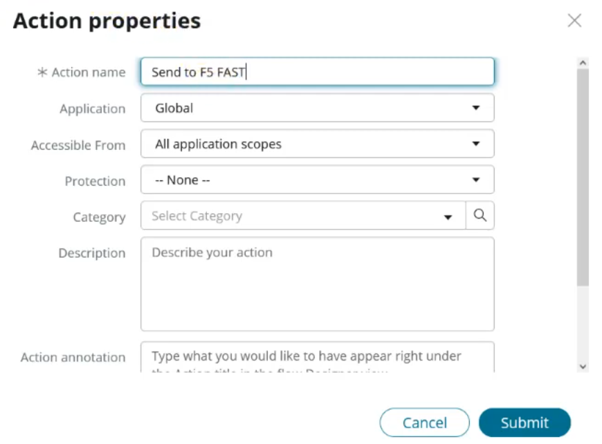

5. Under the Action Outline on the left, click the plus button.

   

6. Inside the step selection prompt, click the REST step link.

   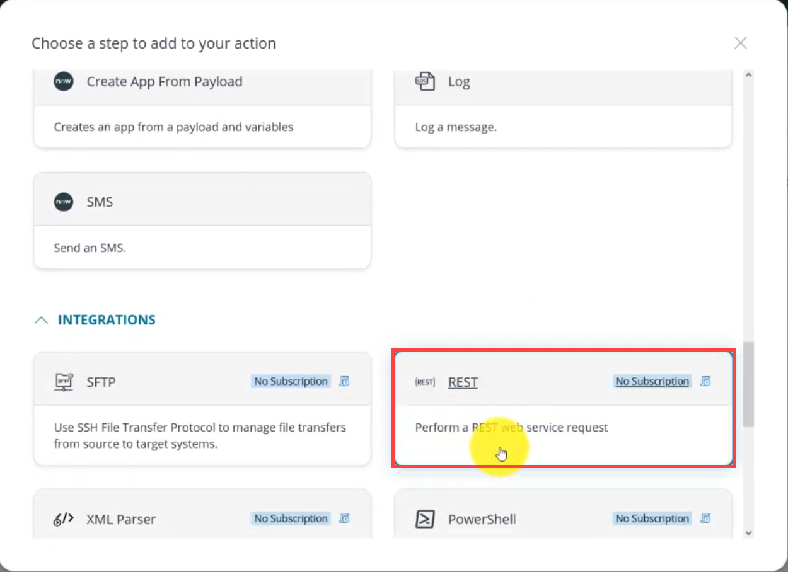

7. Inside the REST step configurations, fill in the following configurations:

   **Connection Alias** - f5_connection
   **Resource Path** - /mnt/shared/fast/applications
   **HTTP Method** - POST
   **Headers**
   * Content-Type - application/json
   
   **Request Body[text]** 
   ```javascript
   return JSON.stringify(fd_data.action_inputs.fast_payload)
   ```

   Make sure the script button() is clicked next to Request Body.

   The rest of the configurations can be left to their defaults.

   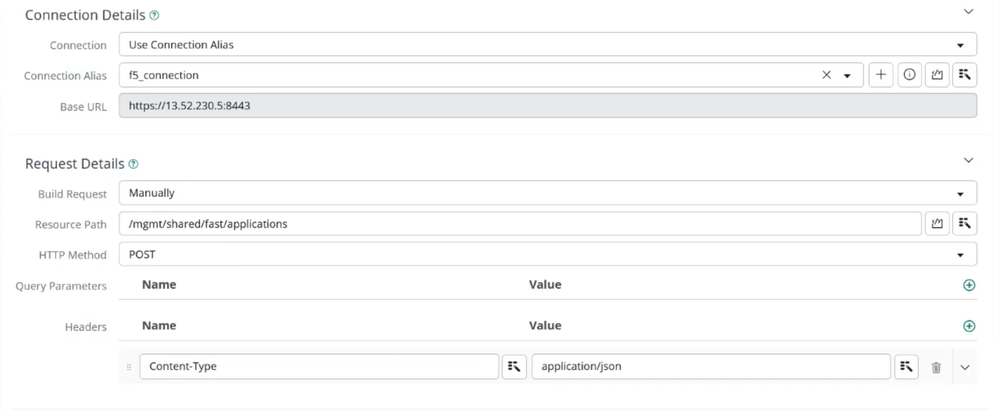
   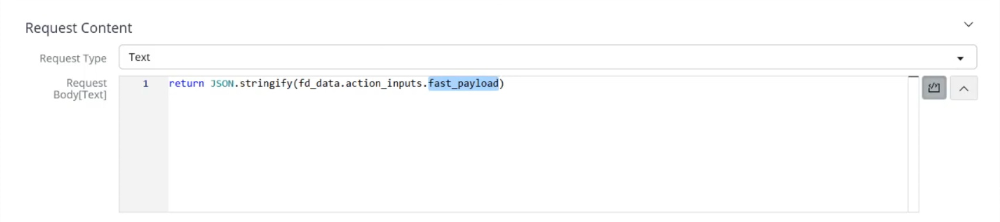

8. Once the REST Step configurations have been filled out, click the ``Inputs`` link under the Action Outline.

   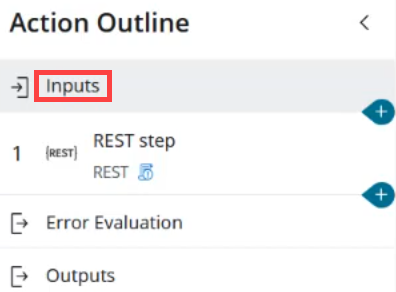

9. Click the ``Create Input`` button and supply the following parameters for a single input.

   **Label** - FAST Payload
   **Name** - fast_payload
   **Type** - JSON
   **Mandatory** - True

   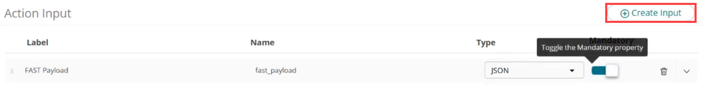

10. Once the input and steps have been filled out, click the ``Save`` and then ``Publish`` buttons.  

    

11. Navigate back to the Flow Designer home screen by clicking the home button in the top left.

    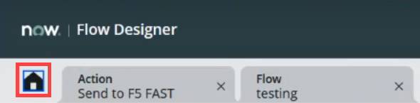

12. Inside the flow designer interface, click the ``New`` button and then the ``Flow`` link.

    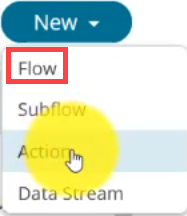

13. Inside the Flow properties prompt, fill in the Flow name ``F5 FAST HTTP`` and click ``Submit``.

    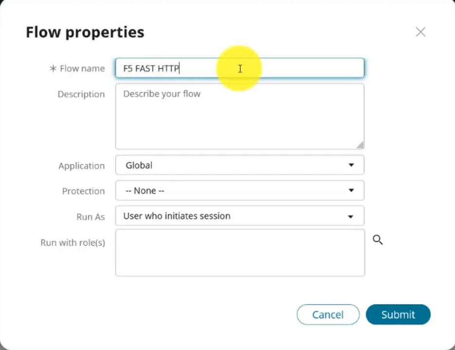

14. Inside the Flow configuration screen, click the ``Add a trigger`` button.

    

15. Search for and select ``Service Catalog`` in the trigger option list.

    

16. Under the Actions section, click the button titled ``Add an Action, Flow Logic, or Subflow`` and then click the ``Action`` button.

    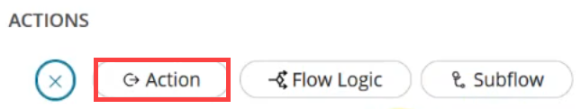

17. Search and select the Action titled ``Send to F5 FAST`` in the Action list.

    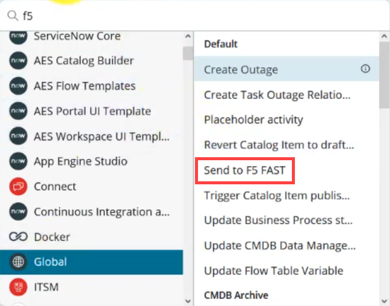

18. Next the FAST Payload text box, click the script button() and populate the following contents in the text box:

    ```javascript
    // Create pool array from service catalog server_addresses variable
    var gr = new GlideRecord("cmdb_ci_server")
    var pool = []
    var serverList = fd_data.trigger.request_item.variables.server_addresses.toString().split(",")

    for (var i = 0; i < serverList.length; i++) {
      gr.get(serverList[i])
      pool.push(gr.ip_address.toString())
    }

    // Create Payload for FAST template from service catalog variable
    var fastPayload = {
      "name": "examples/simple_http",
      "parameters": {
        "tenant_name": fd_data.trigger.request_item.variables.tenant_name.toString(),
        "application_name": fd_data.trigger.request_item.variables.application_name.toString(),
        "virtual_port": parseInt(fd_data.trigger.request_item.variables.virtual_port),
        "virtual_address": fd_data.trigger.request_item.variables.virtual_address.toString(),
        "server_port": parseInt(fd_data.trigger.request_item.variables.server_port),
        "server_addresses": pool
      }
    }

    return fastPayload
    ```

19. Click the ``Done`` button once the Action has been populated.

    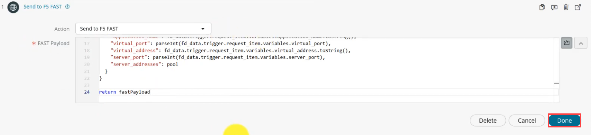

20. Save the Flow by clicking the ``Save`` and then ``Activate`` buttons in the top right of Flow Designer.

    

#### Modifying Required System Properties

1. Inside your developer tenant's ServiceNow homepage, search for ``System Properties`` in the left navigation pane and click the link with the same name.

    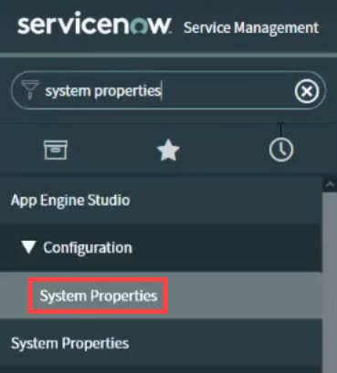

2. Inside the center pane, click the ``All`` breadcrumb above the property list to filter on all system properties.

    

3. In the table search text box, search for the system property name ``com.glide.communications.trustmanager_trust_all``.

    

4. Inside the center pane, double click the value next to the com.glide.communications.trustmanager_trust_all system property.

    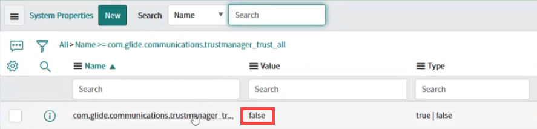

5. Set the value of com.glide.communications.trustmanager_trust_all to ``true`` and click the green checkbox confirming the change.

    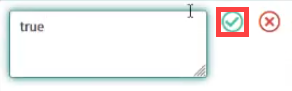

6. In the table search text box, search for the system property name ``com.glide.communications.httpclient.verify_hostname``.

    

4. Inside the center pane, double click the value next to the com.glide.communications.httpclient.verify_hostname system property.

    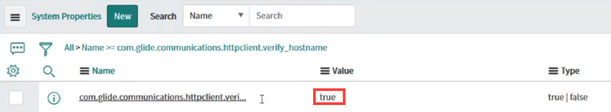

5. Set the value of com.glide.communications.httpclient.verify_hostname to ``false`` and click the green checkbox confirming the change.

    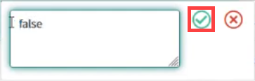

#### Integrating the Service Catalog Item with a Flow

1. Inside your developer tenant's ServiceNow homepage, search for ``My Items`` in the left navigation pane and click the link with the same name.

    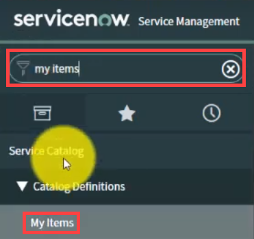

2. Inside the center pane, click the ``All`` breadcrumb above the items list to filter on all catalog items.

    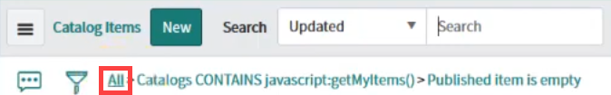

3. Order the catalog item table so the most recently updated item is on top by clicking the ``Updated`` column.

    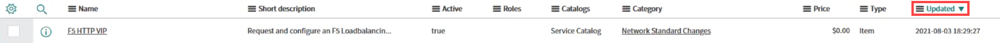

4. Click the catalog item with the name ``F5 HTTP VIP``.

    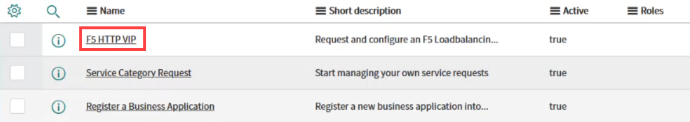

5. Click the ``Process Engine`` tab in the center pane.

    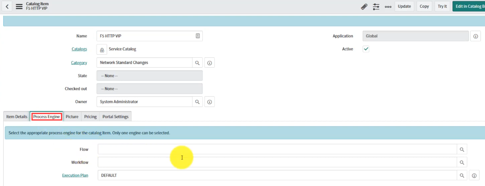

6. Click the search button next to the flow text box.

    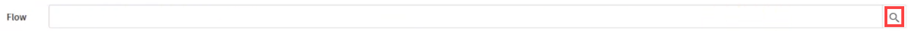

7. Inside the flow list, select the ``F5 FAST HTTP`` flow.

    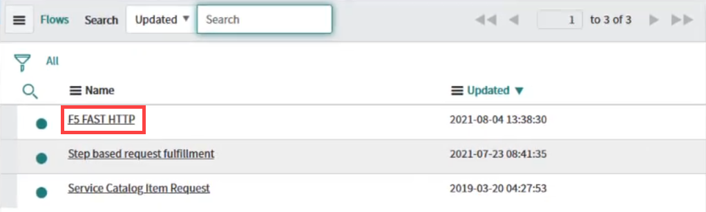

7. Right click the grey title bar at the top and click ``Save``.

    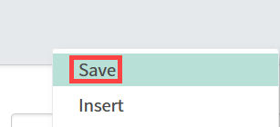

#### Testing the Service Catalog

1. Inside your developer tenant's ServiceNow homepage, search for ``Service Portal Home`` in the left navigation pane and click the link with the same name.

    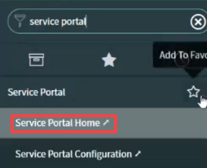

2. Inside the service portal page, click the ``Request Something`` link.

    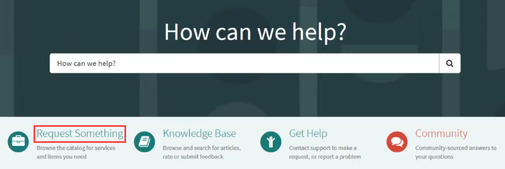

3. Under categories, click on ``Standard Changes`` and then click the ``Network Standard Changes`` link.

    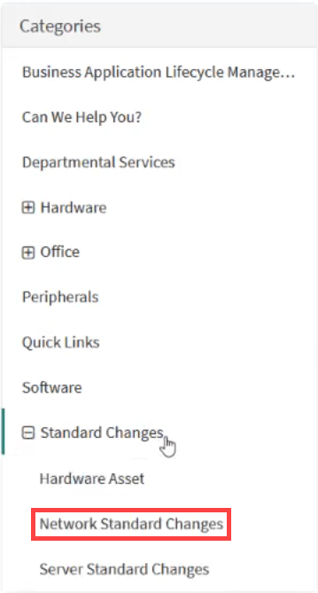

4. Click the catalog item link titled ``F5 HTTP VIP``.

    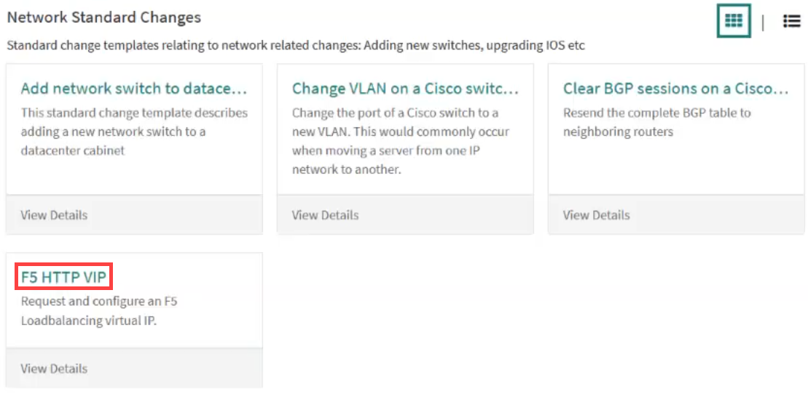

5. Fill out the form to build out the F5 BIG-IP configuration. Use the sndemo-nginx servers as the pool members. Once finished, click the ``Order Now`` button.

    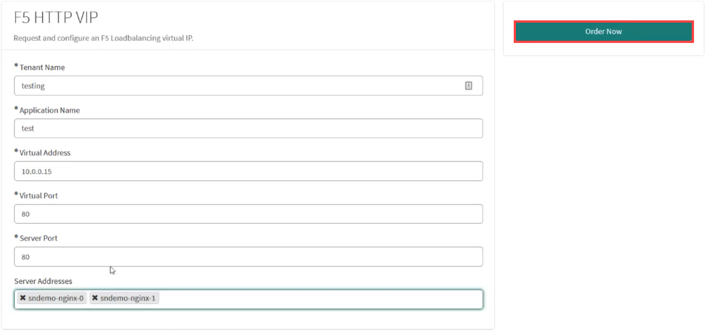

5. Click the ``Checkout`` button.

    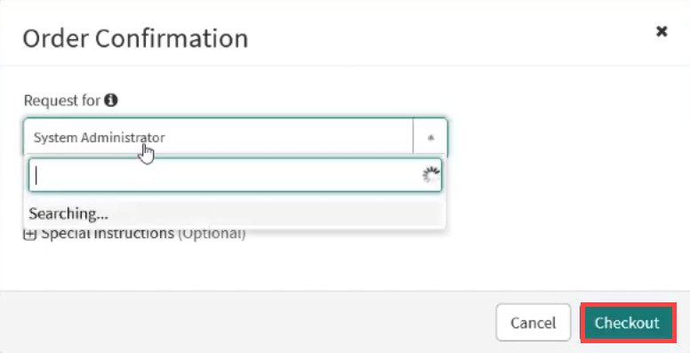

#### Verifying the F5 BIG-IP Configuration

1. Log into the F5 BIG-IP provided in the Terraform output in the earlier steps.

    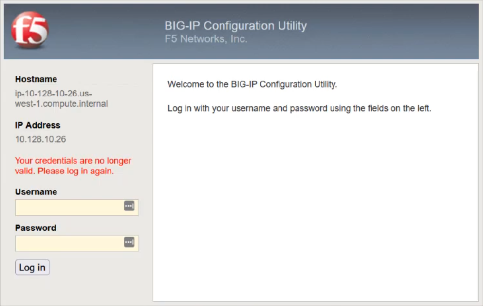

2. Navigate to the ``F5 Application Services Templates`` link under Applications LX.

    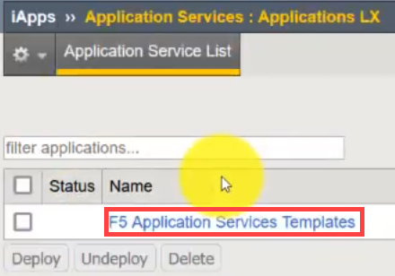

3. Click the ``Applications`` tab and the click on the link for the FAST application that was created.

    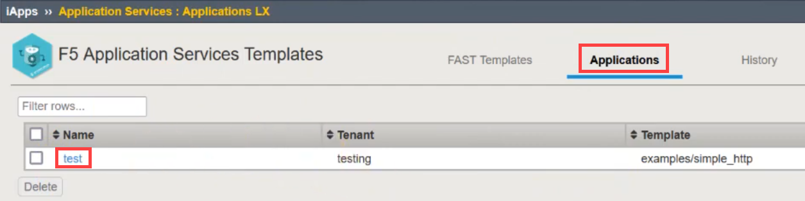

4. The values inside the FAST template should match the values provided with the submitted service catalog form.

    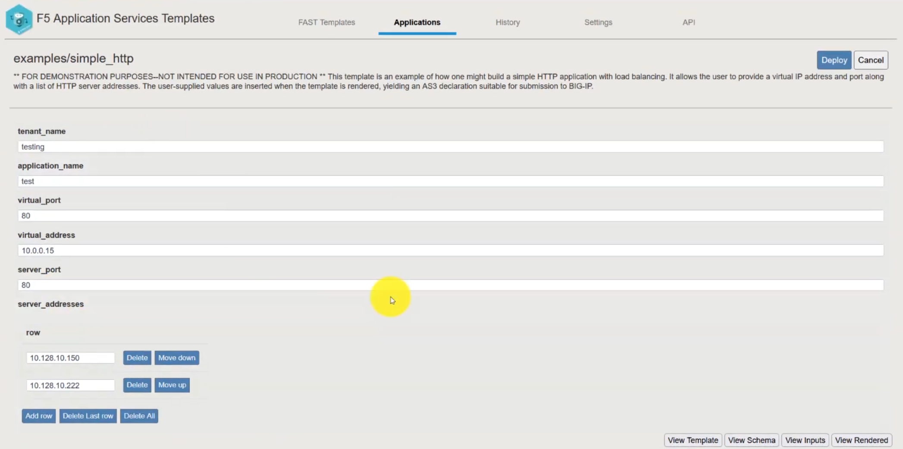

5. Additionally, further validation can be performed by looking through the different configurations created by the FAST template such as the virtual server.

    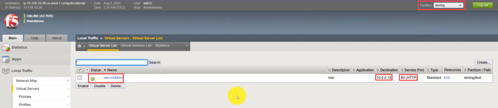
    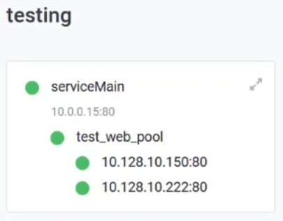


#### Cleanup

To tear down the AWS resources created by the Terraform template, open up a terminal window and run the following command.

```bash
terraform destroy -auto-approve
```

## Next Steps

If you have completed this tutorial, you have taken the first step in understanding how Flow Designer operates in the ecosystem of ServiceNow. The flow you have created is a very simple single step Flow. Additional steps such as approvals and the creation of change tickets can be incorporated very easily into this flow. Further information on the full power of ServiceNow Flows can be found [here](https://docs.servicenow.com/bundle/quebec-servicenow-platform/page/administer/flow-designer/concept/flow-designer.html).